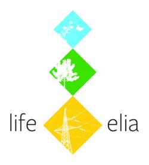

## Dépôt de données pour les plans de gestion du projet [LIFE Elia-RTE](http://www.life-elia.eu/)  

Cet espace héberge un site web statique basé sur **Beautiful Jekyll**, un projet créé par [Dean Attali](http://deanattali.com) et partagé via *Github*.  
> *Copyright 2016 [Dean Attali](http://deanattali.com)*  

Le développement de ce site, des données et des outils qu'il contient ont été développées par [Jean-François Godeau](mailto:jfgodeau@gmail.com) dans le cadre du projet [LIFE+ Biodiversité](http://ec.europa.eu/environment/life/index.htm): [**"LIFE Elia"** (LIFE10 NAT/BE/000709)](http://ec.europa.eu/environment/life/project/Projects/index.cfm?fuseaction=search.dspPage&n_proj_id=4077)  

> Les données contenues dans ce site appartiennent à Elia et ne peuvent pas être utilisées sans autorisation.  